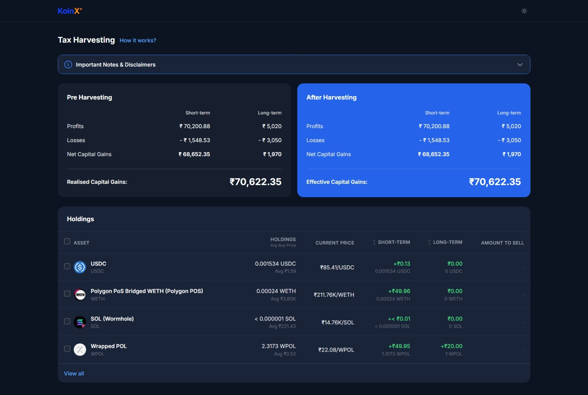
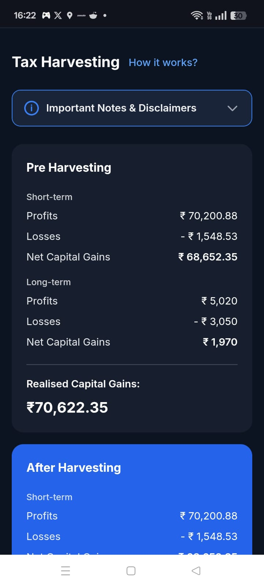

# KoinX Tax Loss Harvesting

React implementation of the KoinX frontend intern assignment. The app loads mock capital gains and holdings data, lets the user select assets to harvest, and updates the after-harvesting card in real time.

## Live Demo

https://koin-x-frontend-intern-assignment-alpha.vercel.app/

## Tech Stack

- React 18 + Vite
- Tailwind CSS v3
- React Context API for global state management
- Mock APIs via Promises (no external server required)

## Setup

```bash
npm install
npm run dev
```

The dev server runs at `http://localhost:5173`.

Other useful scripts:

```bash
npm run build
npm run preview
```

## Features

- Pre-harvesting and after-harvesting capital gains cards
- Mock API calls with loading and error states
- Holdings table with per-row checkbox and select-all
- Total Current Value column derived from holdings × current price
- Short-term and long-term gain columns, sortable
- Amount to Sell populated only for selected rows
- View all / View less for the holdings list
- Light/dark theme toggle with no flash on refresh
- Responsive layout — cards stack on mobile, table scrolls horizontally

## Project Structure

```
src/
  api/          mock API responses (capitalGains.js, holdings.js)
  components/   UI components
  context/      AppContext — shared state and side effects
  utils/        calculations.js, formatters.js
```

## Harvesting Logic

Base capital gains come from `src/api/capitalGains.js`. When a holding row is selected, its STCG and LTCG gains are applied on top of the base figures:

- Positive gain → added to profits
- Negative gain → absolute value added to losses

Net Capital Gains = `profits − losses` for each term. Realised/Effective Capital Gains = STCG net + LTCG net.

The savings banner appears only when the after-harvesting effective capital gains are strictly lower than the pre-harvesting realised capital gains.

## Assumptions

- Currency is shown as ₹ (INR) because the assignment data uses INR-style prices and the spec savings requirement references `₹X`.
- The savings value shown is the reduction in realised gains, not a tax-adjusted figure, because the assignment does not specify a tax rate.
- The mock holdings data contains duplicate coin symbols (e.g. two `USDC` entries). Each row is assigned a unique `id` using `${coin}-${index}` so selection state is independent.
- The original spec holdings have only negligible negative gains (< ₹0.01 total). Three additional holdings - BTC, NEAR, DOT - with realistic losses have been added so the savings banner can be demonstrated during review. They are called out in the holdings API file.

## Screenshots

Desktop (dark mode):



Mobile:


